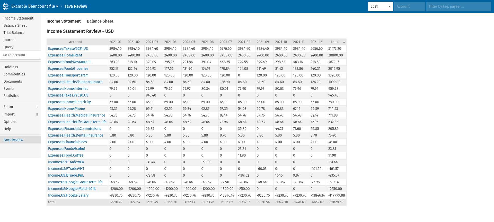

# The problem
[Fava](https://beancount.github.io/fava/index.html) is a great UI for [Beancount](https://beancount.github.io/) however 
it only presents you with a snapshot of your finances for any given time period. Often it is useful to see ones' finances over a series of time periods to:
- Identify trends across accounts (e.g. spending more on food or earning less on interest?)
- Identify which accounts are the greatest contributors to our spending (e.g. the highest value accounts to try and reduce to save money)
- And to spot ingest mistakes (e.g. spikes in bills when it should be flat?)

# A solution

Fava Review is an [extension](https://beancount.github.io/fava/api/fava.ext.html) for 
[fava](https://beancount.github.io/fava/index.html) which takes your finances and presents them over time.

At the moment, only a monthly view is supported.

Also, only an Income & Expense report is supported. 

However, it is possible to filter your accounts by the usual date, account and payee/tag filters.
[Screenshot](screenshot-time-and-account-filter.png).

And it's also possible to sort your data by and month or total column.
[Screenshot](screenshot-sorting.png).

# How it works
fava-review is very simple in its implementation. It uses bean-query through 
[fava](https://beancount.github.io/fava/index.html) FavaLedger class and get the data monthly data for each account. 
This information is then feed into [petl](https://petl.readthedocs.io/en/stable/) and pivoted into the monthly view.

fava-review uses your 

# How to install
`pip install fava-review`

## Requirements
- fava >= 1.20
- beancount <3, >=2.3.0

# Planned Features
- Support yearly, quarterly time intervals.
- Support all currencies within beancount file.
- Additional reports including Assets/Liabilities.
- Percentage changes instead of absolute values.
- Setting projections and tracking actuals against estimates.
- [More](https://github.com/kubauk/fava-review/issues)